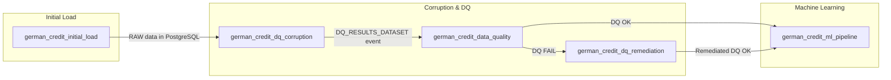

# German Credit – Automated Data Quality, Remediation & Machine Learning Pipeline

This repository contains a **an automated Data Quality (DQ) and Machine Learning (ML) orchestration system** built on:

- **Apache Airflow**
- **PostgreSQL**
- **Python DQ/ML framework**
- **Great Expectations–style YAML validation (Suite)**

It simulates **data corruption, validation, automated remediation, and ML model evaluation** which is versioned, logged, and reproducible.

---

## High-Level Overview

This project demonstrates how modern data platforms enforce **data quality before running ML models**. It supports:

- Automated adjustable corruption experiments based on the selected method
- YAML-driven DQ validation  
- Remediation with drift/bias checks (currently customized for the corruption experiments setting)
- Decision gates controlling whether ML can run  
- Model training, evaluation, and persistence  
- Dataset versioning in PostgreSQL  

---

## What Does The Project Test

- Data corruption significantly impacts ML performance.  
- Automated remediation can restore DQ above defined thresholds.  
- Distribution drift & bias can be detected using **PSI, KL divergence, entropy, percentile shift**.  
- ML pipelines should be **gated by DQ rules** to avoid training on corrupted data.  
- Airflow can orchestrate multi-stage workflows with conditional branching.  
- PostgreSQL can be used as a central store for:
  - raw → corrupted → remediated datasets  
  - DQ validation results  
  - ML performance metrics   

---

## Architecture Overview

### DAG Orchestration (Mermaid)



---

### How to Build Project Environment

**Docker**
**To build the image for the project, run in the project path:**
- docker build -t dp-airflow:3.0.6-custom .

**To run the following build:**
- docker compose build
- docker compose up airflow-init
- docker compose up -d 


### Configuration

**Config file (with the project variables)**
Config is loaded by ProjectConfig in scripts/get_environment_config.py.
Pipeline notebooks, DAGs, and scripts do not hardcode paths — always read them from config.

**yaml_validation_file**
- Description: Name of the YAML file containing DQ validation rules (GX suite).
- Location: include/dq_configs/
- Required: Yes
- Example: german_credit_validation.yaml

**csv_folder**
- Description: Subdirectory inside include/data/ containing the CSV file.
- Required: Yes
- Common values:
- raw → original dataset
- corrupted → corrupted dataset
- Example: raw

**csv_file_for_dq**
- Description: Name of the CSV file used for initial load - ingestion.
- Required: Yes
- Example: german_credit.csv
- Full path: include/data/<csv_folder>/<csv_file_for_dq>

**corruption_function**
- Description: Name of the corruption function/strategy.
- Required: Yes (if using corruption pipeline)
- Allowed values: missing_values, categorical_errors, label_errors, relationship_violation, conjoined_corruption

**corruption_scenario**
- Description: Selected corruption scenario or intensity level.
- Required: Yes
- Example: severe
  
**dq_threshold**
- Description: Minimum DQ success rate (%) required for ML pipeline to run.
- Required: Yes
- Example: 90

**run_id**
- Description: Identifier linking pipeline stages (initial load, corruption, DQ).
- Required: Yes
- Example: "initial_load"

**database.table_name**
- Description: Base name for all tables created in PostgreSQL.
- Used to generate:
- raw_<table_name>
- corrupted_<table_name>
- remediated_<table_name>
- Required: Yes
- Example: german_credit_data

**database.schema**
- Description: Name of the PostgreSQL schema.
- Required: Yes
- Example: public


When adding new corruption strategies or DQ rules, update:
- YAML validation config and change the name in the project config

---

 ### DAG Descriptions
 
1️) german_credit_initial_load
- Purpose: One-time initial load of the original German Credit CSV into PostgreSQL.
- Reads CSV from path defined in ProjectConfig.
- Normalizes column names.
- Inserts into raw_german_credit_data (wrapped as raw_<base_table_name>).
- Generates dataset_id like il_YYMMDD_HHMM.

2️) german_credit_dq_corruption
- Purpose: Create corrupted datasets and run DQ checks on them.
- Loads original data from the RAW table.
- Applies one of the corruption strategy:
   - missing values
   - numerical outliers
   - categorical noise
   - label errors
   - business rule violations
   - combined corruption
- Stores results in corrupted_german_credit_data with dataset_id = corrupt_YYMMDD_HHMM.
- Runs DQ validation on the corrupted data.
- Outputs stats and triggers DQ_RESULTS_DATASET for downstream DQ DAG.

3️) german_credit_data_quality
- Purpose: Validate corrupted data quality and decide the next step.
- Loads the latest corrupted dataset.
- Runs YAML-based DQ checks (completeness, validity, ranges, sets, relationships).
- Logs:
   - success rate
   - total / successful / failed expectations
   - failing columns and expectation types
- Compares success_rate to dq_threshold from config.
- Branches:
   - If DQ OK (>= threshold) → triggers german_credit_ml_pipeline.
   - If DQ FAIL → triggers german_credit_dq_remediation.

4️) german_credit_dq_remediation
- Purpose: Remediate low-quality datasets and try to raise DQ above threshold.
- Loads the corresponding corrupted dataset by dataset_id.
- Applies remediation via DQImprovementPipeline, including:
   - missing value imputation (median/mode, KNN, iterative imputation),
   - outlier correction (IQR, Isolation Forest, capped replacement),
   - categorical value repair via valid sets,
   - relationship correction between business columns.
- Evaluates remediation impact:
   - PSI, KL divergence, entropy change, percentile drift.
- Saves remediated data to remediated_german_credit_data.
- Re-runs DQ validation.
- If DQ score ≥ threshold → triggers german_credit_ml_pipeline.

5️) german_credit_ml_pipeline
- Purpose: Run the full ML workflow on the selected dataset (corrupted or remediated).
- Loads data from:
   - raw_german_credit_data,
   - corrupted_german_credit_data, or
   - remediated_german_credit_data (depending on trigger)
- Uses MLRunner to:
   - preprocess features (encoding, scaling, splitting),
   - train following models: Logistic Regression, Random Forest,
   - evaluate on test and via cross-validation,
   - log performance metrics.
- Stores results in ml_results

--- 

### Data flow Diagram

```mermaid
sequenceDiagram
    participant IL as german_credit_initial_load
    participant DB as PostgreSQL
    participant CORR as german_credit_dq_corruption
    participant DQ as german_credit_data_quality
    participant REM as german_credit_dq_remediation
    participant ML as german_credit_ml_pipeline

    Note over IL: One-time manual run
    IL->>DB: INSERT raw_german_credit_data (dataset_id = il_YYMMDD_HHMM)

    Note over CORR: Scheduled (@daily) or manual
    CORR->>DB: SELECT raw_german_credit_data<br/>data_source = 'original_csv'
    CORR->>DB: INSERT corrupted_german_credit_data<br/>dataset_id = corrupt_YYMMDD_HHMM
    CORR-->>DQ: Emit DQ_RESULTS_DATASET (dataset event)

    Note over DQ: Scheduled by DQ_RESULTS_DATASET
    DQ->>DB: SELECT corrupted_german_credit_data<br/>by latest dataset_id
    DQ->>DQ: run_data_quality_from_yaml_and_dataframe()
    DQ-->>DQ: Compute success_rate, failed_expectations
    alt DQ success (>= threshold)
        DQ-->>ML: TriggerDagRun (german_credit_ml_pipeline)<br/> + table_name + dataset_id
    else DQ fail (< threshold)
        DQ-->>REM: TriggerDagRun (german_credit_dq_remediation)<br/> + failed_expectations + stats + dataset_id
    end

    Note over REM: Remediation path
    REM->>DB: SELECT corrupted_german_credit_data<br/>by dataset_id
    REM-->>DB: INSERT remediated_german_credit_data<br/>dataset_id = remed_...
    REM-->>DQ: run_data_quality_from_yaml_and_dataframe() on remediated data
    alt Remediation success (>= threshold)
        REM-->>ML: TriggerDagRun (german_credit_ml_pipeline)<br/> + remediated table_name + dataset_id
    else Remediation fail
        REM-->>REM: stop / manual investigation
    end

    Note over ML: Final stage
    ML->>DB: SELECT {raw/corrupted/remediated}_german_credit_data<br/>by dataset_id
